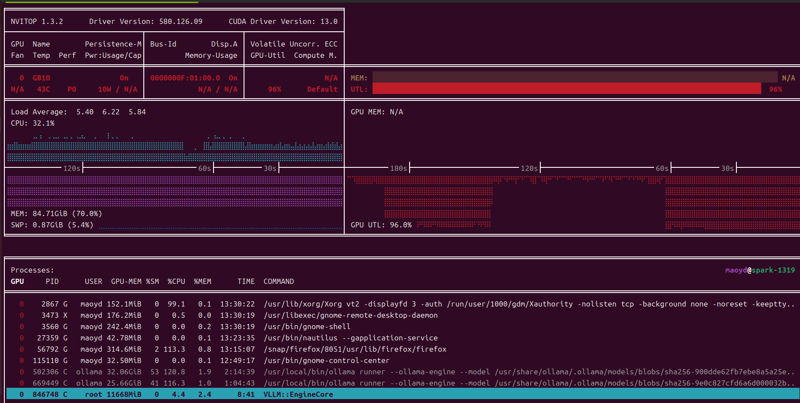

<div align="center">

# Sovereign-IQ

**AI 多 Agent 智能投研决策系统**

面向中国一级市场的投资委员会模拟系统 —— 7 个专业化 AI Agent 协同尽调、对抗论证、知识沉淀


## 核心特色

采用“共享底稿库 + 角色私有知识库”架构，科学合理的信息分配既保证了每位领域专家 Agent 基于“同一项目事实基础”上，基于各自领域专业知识发表专业化的有深度的观点。

**极致性能双模驱动** —— 单机同时加载 Nemotron与 Qwen双模型，充分发挥nemotron模型的调度能力+千问模型中文语义理解和推理能力，结合 Embedding 与 Milvus 矢量数据库，深度榨取硬件性能，实现“专模专用”的协同效应。

**信息底稿全方位扫描**——秘书通过对底稿材料的深度学习，利益企查查数据接口及搜索工具，全网获取项目信息，并进行比对，形成信息核对报告，发送给人类确认后，再开展投研工作。

**对抗式多轮论证** —— R1 独立分析 → R2 交叉质证 → R3 红蓝对抗，三轮递进消除信息盲区与群体思维

**知识结晶与进化** —— 每次投委会讨论中产生的报告存入openclaw共享文件夹，所有agent可见，多轮辩论逐级萃取核心观点，有价值的报告经人类审核后，再次导入agent的知识库，实现agent的持续进化

**全链路可审计** —— 从文档摄入到最终决策，完整记录推理链路、证据来源与观点演变过程

**人机主权决策** —— AI 提供结构化分析框架与证据支撑，人类保留最终决策权，不替代判断


---

## 系统架构

```
┌─────────────────────────────────────────────────────────┐
│                    Master Coordinator                   │
│              (流程编排 · 进度追踪 · 报告聚合)              │
├─────────────┬──────────┬──────────┬──────────┬──────────┤
│ Strategist  │ Sector   │ Finance  │ Legal    │ Risk     │
│   宏观策略   │ 行业分析  │ 财务审计  │ 法务合规   │ 风控评估  │
├─────────────┴──────────┴──────────┴──────────┴──────────┤
│                    IC Chairman                          │
│               (综合裁决 · Go/No-Go 决策)                  │
└─────────────────────────────────────────────────────────┘ 
│              Milvus 向量知识库 (9 集合)                   │
│   专家私有库 × 7  ·  协作共享库 × 1  ·  归档库 × 1          | 
└─────────────────────────────────────────────────────────┘
```

---

## 投委会流程

| 阶段 | 内容 | 产出 |
|------|------|------|
| **文档摄入** | 自动解析 PDF/DOCX/MD，向量化存入专家私有知识库 | 项目知识底座 |
| **R1 独立尽调** | 5 位专家并行分析，六维评分（赛道β、公司α、行业地位、法律合规、估值风险、技术壁垒） | 各领域独立报告 |
| **R2 交叉质证** | 针对争议点补充论证，修正风险评估 | 更新报告 + 争议消解 |
| **R3 红蓝对抗** | 红蓝双方压力测试核心假设，推演极端情景 | 风险概率调整 + 严苛条件 |
| **主席裁决** | 综合定量（30%）与定性（70%），输出投资建议 | IC 决策报告 |

---

## Agent 角色定义

| Agent | 职责 | 核心能力 |
|-------|------|----------|
| **IC Chairman** | 最终裁决与冲突仲裁 | 六维评估框架、Go/No-Go 决策树、退出策略评估 |
| **Strategist** | 宏观政策解读、资本流向、赛道配置 | 政策影响评估、经济周期匹配、赛道吸引力评分 |
| **Sector Expert** | 行业深度分析、技术路线评估 | TAM/SAM/SOM 测算、波特五力、技术成熟度曲线 |
| **Finance Auditor** | 财务建模、估值验证、真实性核查 | 多阶段估值模型（Berkus/VC/DCF）、FIRE 诊断、压力测试 |
| **Legal Scanner** | 合规审查、诉讼穿透、条款风险评估 | 50+ 项尽调清单、合规指数量化、红线问题识别 |
| **Risk Controller** | 风险量化、舆情监控、红黄线判定 | 风险评分模型（0-100）、多情景生存分析、ESG 评估 |
| **Master Coordinator** | 流程编排、数据交叉验证、审计链生成 | 并行尽调调度、三源数据整合（QCC+Tavily+Exa） |

---

## 模型配置

采用「共享专家模型 + 独立协调模型」架构 —— 6 位专家共享同一模型实例，Coordinator 使用独立模型专职协调，在 128GB 显存内实现 7-Agent 并发。

| Agent | 推理模型 | 向量模型 |
|-------|----------|----------|
| **IC Chairman** | Qwen3.5-35B-A3B | Qwen3-vl-embedding-2b (1024 维) |
| **Finance Auditor** | Qwen3.5-35B-A3B | Qwen3-vl-embedding-2b (1024 维) |
| **Sector Expert** | Qwen3.5-35B-A3B | Qwen3-vl-embedding-2b (1024 维) |
| **Legal Scanner** | Qwen3.5-35B-A3B | Qwen3-vl-embedding-2b (1024 维) |
| **Strategist** | Qwen3.5-35B-A3B | Qwen3-vl-embedding-2b (1024 维) |
| **Risk Controller** | Qwen3.5-35B-A3B | Qwen3-vl-embedding-2b (1024 维) |
| **Master Coordinator** | Nemotron-Cascade-2-30B-A3B | Qwen3-vl-embedding-2b (1024 维) |

> 所有模型通过 Ollama 本地部署于 NVIDIA DGX Spark（GB10, 128GB Unified Memory）。6 位专家共享 Qwen3.5-35B-A3B-FP8（262K 超长上下文，Blackwell FP8 量化），Coordinator 由 Nemotron-Cascade-2-30B-A3B 独立承担协调与编排，角色通过 System Prompt（SOUL.md）+ 独立 Milvus Collection 实现知识物理隔离。

---

## 技术栈

| 层级 | 技术选型 |
|------|----------|
| **推理模型** | Qwen3.5-35B-A3B（6 专家共享）、Nemotron-Cascade-2-30B-A3B（Coordinator 独立） |
| **向量模型** | Qwen3-vl-embedding-2b（1024 维，GPU 加速） |
| **向量数据库** | Milvus 2.6.13（HNSW GPU 索引，9 个 Collection） |
| **Agent 框架** | OpenClaw（多 Agent 编排，会话持久化） |
| **模型服务** | Ollama（本地部署，API 兼容） |
| **GPU 加速** | CUDA 全链路 + CuPy 向量运算 + Blackwell FP8 Tensor Core |
| **文档解析** | PyMuPDF（空间 PDF 解析）、python-docx |
| **数据源** | 企查查 MCP、Tavily、Exa、AkShare |

---

## 知识管线

```
1#env_setup.py            初始化 Milvus 集合与索引
2#knowledge_feeder.py     GPU 加速批量知识注入
3#project_ingestor.py     多格式文档自动处理（状态机：incoming → processed/failed）
4#evolution_recorder.py   讨论记录 + 知识结晶（双存储：共享库 + 私有库）
5#unified_retriever.py    跨集合联邦检索 + 证据链构建
6#archive_manager.py      已完结项目归档 + 存储空间自愈
7#knowledge_ingestor_pro.py  异步多格式高并发注入引擎
```

---

## 项目结构

```
sovereign-IQ/
├── milvus_knowlege_setup/        # 知识管线脚本
│   ├── 1#env_setup.py
│   ├── 2#knowledge_feeder.py
│   ├── 3#project_ingestor.py
│   ├── 4# evolution_recorder.py
│   ├── 5# unified_retriever.py
│   ├── 6# archive_manager.py
│   └── 7#knowledge_ingestor_pro.py
├── workspace/                    # Agent 工作空间
│   ├── ic_chairman_workspace/
│   ├── ic_finance_auditor_workspace/
│   ├── ic_sector_expert_workspace/
│   ├── ic_legal_scanner_workspace/
│   ├── ic_strategist_workspace/
│   ├── ic_risk_controller_workspace/
│   ├── ic_master_coordinator_workspace/
│   ├── skills/                   # 39 个专业技能定义
│   └── connect_existing_collections.py
├── 测试案例生成报告供参考/         # 宇树机器人多轮对抗测试报告
├── 部分调研资料/                      # 调研资料
├── SIQ_系统介绍_技术文档.pdf
└── TODO.md
```

---

## 测试图片


## 

## License

See [LICENSE](LICENSE).
